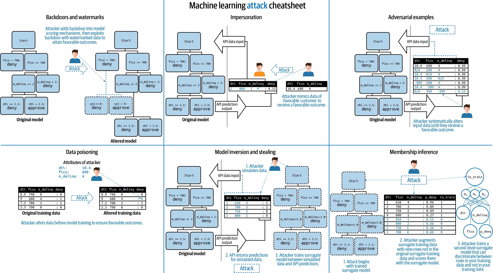

# Secure Audits for Machine Learning Attacks

####Presented at MLOps World 2021 on June 16th

####Presenters: Navdeep Gill & Michelle Tanco

## Abstract

There are several known attacks against ML models that can lead to altered, harmful model outcomes or exposure of sensitive training data. Unfortunately, traditional model assessment measures don’t tell us much about whether a model is secure. In addition to other debugging steps, it may be prudent to add some or all of the known ML attacks into any white-hat hacking exercises or red-team audits your organization is already conducting. This talk will go over common machine learning security attacks and the remediation steps an organization can take to deter these pitfalls.

Source: O'Reilly Media, [_Responsible Machine Learning_](http://info.h2o.ai/rs/644-PKX-778/images/OReilly_Responsible_ML_eBook.pdf), Patrick Hall, Navdeep Gill, and Benjamin Cox.

##References
* [*Proposals for model vulnerability and security*](https://www.oreilly.com/ideas/proposals-for-model-vulnerability-and-security) on O'Reilly Ideas
* [*Can Your Machine Learning Model Be Hacked?!*](https://www.h2o.ai/blog/can-your-machine-learning-model-be-hacked/) on the [h2o.ai](https://www.h2o.ai) blog site.